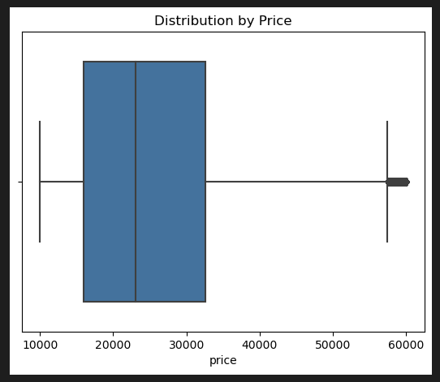
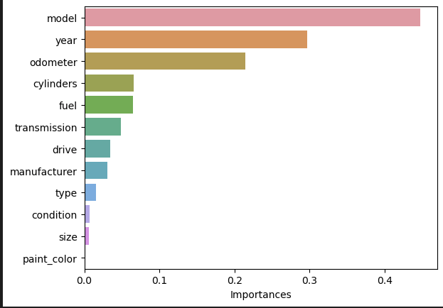

# What Drives the Price of a Car

## OVERVIEW

In this application, you will explore a dataset from kaggle. The original dataset contained information on 3 million used cars. The provided dataset contains information on 426K cars to ensure speed of processing. Your goal is to understand what factors make a car more or less expensive. As a result of your analysis, you should provide clear recommendations to your client -- a used car dealership -- as to what consumers value in a used car.

## Dataset
[vehicles.csv](https://github.com/ronalcamilo/practical_application_assignment_11_1/blob/main/data/vehicles.csv)

## Notebook
[Notebbook](https://github.com/ronalcamilo/practical_application_assignment_11_1/blob/main/prompt_II.ipynb)

## CRISP-DM Framework

## Business Understanding
From a business perspective, we are tasked with identifying key drivers for used car prices.  In the CRISP-DM overview, we are asked to convert this business framing to a data problem definition.  Using a few sentences, reframe the task as a data task with the appropriate technical vocabulary. 

####  Background:
According to recent data from the Bureau of Labor Statistics (BLS), vehicle transaction prices-the price you end up paying after any dealer discounts or surcharges-have risen higher and faster since 2020 than at any time in more than 35 years.

#### Business Objectives
Due to the difficulty of the last few years and the drop in sales of used vehicles, we seek to use the information collected to predict which are the best characteristics of used vehicles and with this data to improve the stock.

####  Business Success Criteria
* Provide relevant information for future sales
* Stock improvement based on forecasting.
* Improve sales campaigns

#### Data Understanding
After considering the business understanding, we want to get familiar with our data.  Write down some steps that you would take to get to know the dataset and identify any quality issues within.  Take time to get to know the dataset and explore what information it contains and how this could be used to inform your business understanding.

#### Collect Initial Data
this data is provide by clients 426K

### Describe Data
We find in the information provided identification data of the different vehicles, with their respective most relevant and grouping characteristics.
* id: unique identifier
* region: place of sale
* price: sales value
* year: year of construction
* manufacturer: vehicle manufacturer
* model: model of the vehicle
* condition: known condition
* cylinders: cylinder capacity 
* fuel: type of fuel
* odometer: mileage
* title_status: not described
* transmission: transmission type
* VIN: engine identification
* drive: drive type
* size: size
* type: type category
* paint_color: Vehicle color
* state: State

### Data Preparation
After our initial exploration and fine tuning of the business understanding, it is time to construct our final dataset prior to modeling.  Here, we want to make sure to handle any integrity issues and cleaning, the engineering of new features, any transformations that we believe should happen (scaling, logarithms, normalization, etc.), and general preparation for modeling with `sklearn`. 

A search for column values with null information was performed. Values with null values, we proceed to complete the values with the mode, so as not to eliminate these records. 

### Distributions Data

Once we have corrected the null data, we proceed to look for unique values in order to simplify the values by eliminating some that are not important in my opinion.

It is also important to review the values. limits that generate outliers and we have found that in the price and odometer we found a fairly diffuse distribution which allows us to have fewer values that alter the analysis.

#### Price

remove < 10000 and > 60000

#### Odometer

remove > 500000

#### Correlations

### Modeling

With your (almost?) final dataset in hand, it is now time to build some models.  Here, you should build a number of different regression models with the price as the target.  In building your models, you should explore different parameters and be sure to cross-validate your findings.

### Linear Regresion Simple
{'Key': 'Linear Regression', 'Train MSE': 0.06416739148266809, 'Test MSE': 0.06416720636550641, 'Train R2': 0.6569988198669485, 'Test R2': 0.6587807884846633}

### Linear Regression with polynomial features
{'Key': 'Linear Regression With Polynomial', 'Train MSE': 0.04397873928791316, 'Test MSE': 0.04447091838455712, 'Train R2': 0.764915494802489, 'Test R2': 0.7635188974862624}

### Ridge
{'Key': 'Linear Regression With Ridge', 'Train MSE': 0.04869846967919495, 'Test MSE': 0.04930280775179369, 'Train R2': 0.7396865887068322, 'Test R2': 0.7378245658579481}

###  Lasso
{'Key': 'Lasso', 'Train MSE': 0.07033966051800206, 'Test MSE': 0.07016474034010842, 'Train R2': 0.6240054954649417, 'Test R2': 0.626887958334117}

### RFE & Lasso
{'Key': 'RFE', 'Train MSE': 0.09836661344202391, 'Test MSE': 0.09935143876585147, 'Train R2': 0.4741898693915402, 'Test R2': 0.4716830992221339}

### GridSearchCV
{'Key': 'Ridge + GridSearchCV', 'Train MSE': 0.09836661344202391, 'Test MSE': 0.09935143876585147, 'Train R2': 0.4741898693915402, 'Test R2': 0.4716830992221339}

### Evaluation

With some modeling accomplished, we aim to reflect on what we identify as a high quality model and what we are able to learn from this.  We should review our business objective and explore how well we can provide meaningful insight on drivers of used car prices.  Your goal now is to distill your findings and determine whether the earlier phases need revisitation and adjustment or if you have information of value to bring back to your client.

It can be seen that the best mse for all the models was linear regression with polynomial

The highest R2 also for this is that of linear regression with polynomial

### Permutation importances

model    0.447 +/- 0.003
year     0.296 +/- 0.003
odometer 0.215 +/- 0.002
cylinders 0.066 +/- 0.001
fuel     0.065 +/- 0.001
transmission 0.049 +/- 0.001
drive    0.034 +/- 0.001
manufacturer 0.031 +/- 0.001
type     0.016 +/- 0.000
condition 0.007 +/- 0.000
size     0.006 +/- 0.000
paint_color 0.002 +/- 0.000

In the permutation importance analysis it can be seen that the most important characteristics are Model, Year, Odometer and Cylinders.

### Deployment

Now that we've settled on our models and findings, it is time to deliver the information to the client.  You should organize your work as a basic report that details your primary findings.  Keep in mind that your audience is a group of used car dealers interested in fine tuning their inventory.

After knowing the information provided, we proceeded to analyze the information by adjusting different models to find the closest in predictions, and thus be able to find the correlative values that allow us to find which are the properties that make a car more or less expensive.

One of the important factors was to remove outliers that could divert our attention and generate high errors in our analysis.

#### Feature: Model 
for the model we chose the first 15 most expensive records and the 15 cheapest records and we can see that there are quite exclusive models in the 59999 range.

#### Feature: Year
The characteristic year, you can see a behavior of the average value according to the year depending on what happened in different periods of time.
We can also see the influence of the classic cars in the value, and the valuation of the last ones that has happened in the last years. 

#### Feature: Cylinders
the cylinders influence the price the more cylinders have a higher value except for 8 and 6 which are the majority of engines of luxury vehicles.

#### Feature: Odometer
the odometer influences the price because according to the concept of used cars when an odometer has more than 100,000 miles it generates maintenance that generates an additional cost after the purchase, which lowers the value of the used vehicle.

#### conclusions

It can be said that the model, year and odometer significantly influence the behavior of the price, more exclusive and recent models cause the price to increase drastically, while previous years cause the price to decrease except in cars that are very old or called collectors, also when the car has miles greater than 100,000 it generates a drop in its values

### Next Steps
1. Deepen the search for new models to try to find better models.
2. Categorize the odometers in order to be able to see the behavior of this grouping in the analysis.
3. Running models without excluding all information

### Recomendations
1. Test models with all dataset information
2. Categorize and unify models and brands to find patterns that indicate pricing influence

